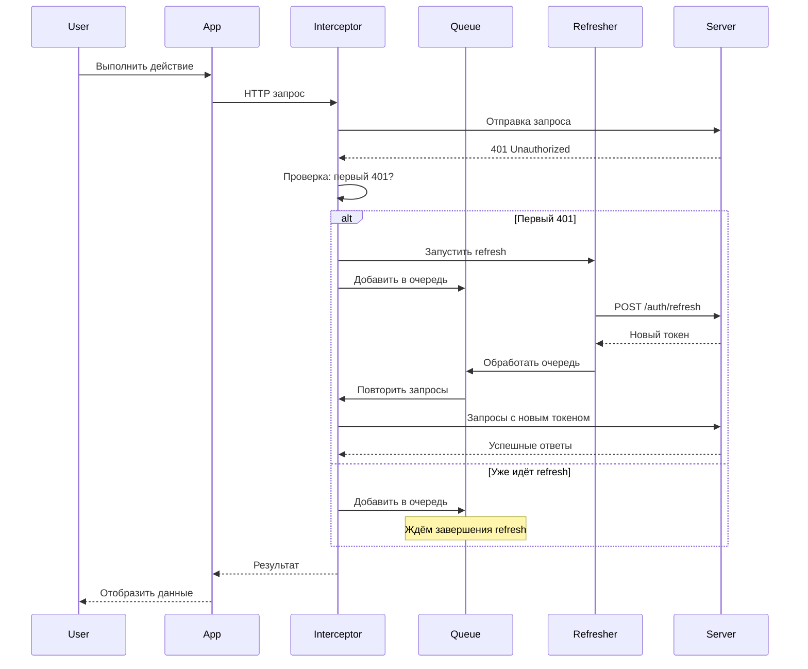
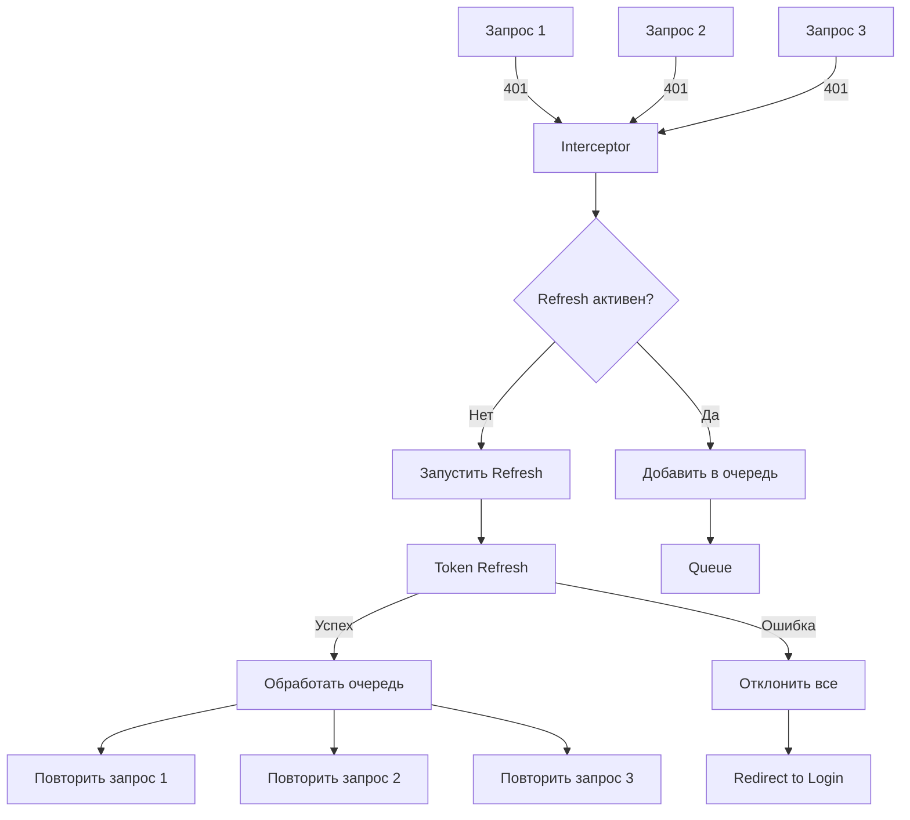
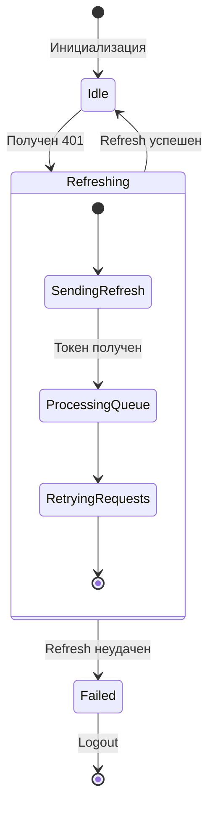
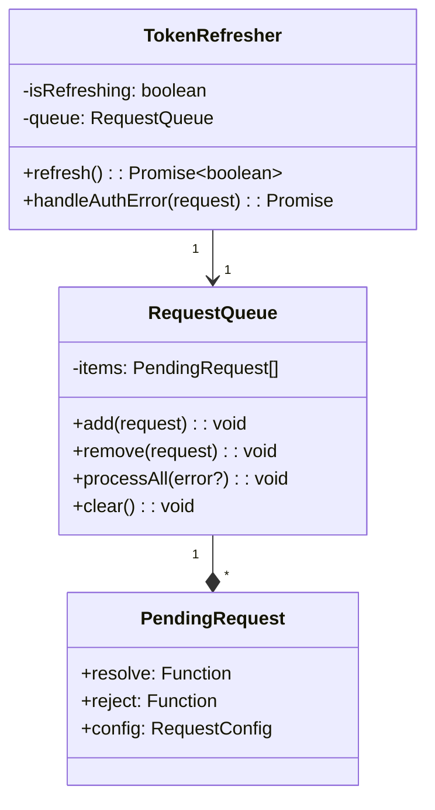
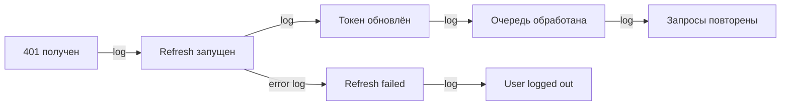

# Архитектура Token Renewal

## Обзор

Система автоматического обновления токенов состоит из трёх основных компонентов:

1. **Interceptor/Link** - перехватывает 401 ошибки
2. **Queue Manager** - управляет очередью запросов
3. **Token Refresher** - выполняет обновление токена

## Диаграммы

### Общий поток работы



### Обработка параллельных запросов



### Состояния системы



### Структура очереди запросов



## Детали реализации

### 1. Axios Interceptor

```typescript
// Упрощённая схема работы
interceptor.response.use(
  response => response,
  error => {
    if (error.response?.status === 401) {
      if (!isRefreshing) {
        isRefreshing = true
        return refreshAndRetry(error.config)
      } else {
        return queueRequest(error.config)
      }
    }
    return Promise.reject(error)
  }
)
```

### 2. Apollo Link

```typescript
// Упрощённая схема работы
new ApolloLink((operation, forward) => {
  return new Observable(observer => {
    forward(operation).subscribe({
      error: (error) => {
        if (isAuthError(error)) {
          handleAuthError(operation, observer)
        } else {
          observer.error(error)
        }
      }
    })
  })
})
```

## Ключевые особенности

### Синхронизация

- **Единственный refresh**: Использование флага `isRefreshing` гарантирует только один запрос обновления
- **Очередь запросов**: Все 401 запросы во время refresh добавляются в очередь
- **Атомарность**: Либо все запросы успешны, либо все отклонены

### Сохранение контекста

- **Конфигурация запроса**: Полностью сохраняется для повтора
- **Headers**: Все заголовки переносятся в повторный запрос
- **Body/Payload**: Данные запроса сохраняются без изменений

### Обработка ошибок

- **Graceful degradation**: При невозможности refresh - редирект на login
- **Отмена запросов**: Поддержка AbortController
- **Timeout**: Защита от бесконечного ожидания

## Метрики и мониторинг

### Важные метрики

1. **Refresh Rate**: Количество refresh в единицу времени
2. **Queue Size**: Размер очереди ожидающих запросов
3. **Success Rate**: Процент успешных refresh
4. **Latency**: Время от 401 до успешного повтора

### Точки логирования



## Безопасность

### Защитные механизмы

1. **Ограничение попыток**: Только один retry после refresh
2. **Валидация токена**: Проверка на сервере независимо от клиента
3. **Изоляция контекста**: Каждый запрос имеет свой контекст
4. **Timeout protection**: Защита от долгих refresh

### Потенциальные уязвимости

- **Race conditions**: Решены через единую очередь
- **Token leakage**: Токены только в httpOnly cookies
- **CSRF**: Защита через SameSite cookies
- **XSS**: Экранирование всех выводимых данных
